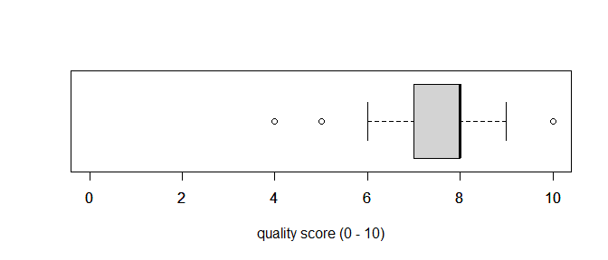

# Introduction

This short document summarizes the feedback provided by attendees of the 4th EFSPI regulatory statistics workshop in Basel 23/24th September 2019. The first few paragraphs are a curated summary of the free text fields, followed by a display of the raw data. For curation, I extracted the two main themes from every free text field (so the total frequency in curated tables can be up to $2 \cdot 49 = 98$).

# Management summary

* Median rating was 8/10.
* Most liked:
  * Presence of regulators.
  * Relevance of topics.
  * Panel discussions.
* Most disliked:
  * RWD sessions, the were perceived to lack focus (also feedback from personal communications).
  * The location is maybe less liked than we think, especially the chairs!
  * Quality of talks: not adjusted for time, busy slides, two presenters for one talk, ...
* Topics for 2020:
  * Estimands (in the barchart, more estimand entries with comments are also found with lower frequencies).
  * Safety.
  * Involvement of HTA.

Please also have a look at the very last bullet point: "Comments (raw data)". These, I did not curate. Some key comments:

* Better prepare panel discussions.
* Share questions of Session 6 with panel before, and have them prepare better.
* Gender distribution (chairs, speakers).

# External feedback

[Summary article by two participants](https://4pharma.com/impressions-from-2019-efspi-regulatory-statistics-workshop/)

# Curated summary 

## Response

We had 49 attendees complete the feedback questionnaire.

## Overall rating

Questionnaire question: _How do you rate the overall quality of the workshop (0 = useless, 10 = world class)?_

--------------- --- --- --- ---- ----- ---- ----- --- ---- -----
  **rating**     4   5   6   7    7.5   8    8.5   9   10   Sum 

 **frequency**   1   1   1   13    2    20    1    5   4    48  
--------------- --- --- --- ---- ----- ---- ----- --- ---- -----

The median rating was 8.

## What did you like most about this workshop (curated)?

## What did you dislike most about this workshop (curated)?

## Quality of session themes?

## Quality of talks?

## Quality of location?

# Topics for 2020

# Display of raw data

## Question: What did you like most about this workshop (raw data)?

--------------------------------
         Like the most          
--------------------------------
     Input from regulators,     
 discussion of topics relevant  
   to clinical statisticians    

  Good selection of up to date  
 topics, open discussion, very  
     interesting for a non      
        biostatistician         

       Location in Basel        

     Interesting topics and     
      presentations + good      
 opportunities for netoworking  
        and socialising         

    The short format of the     
         presentations          

  Presentations - interactions  

  Interactions with regulators  
      in informal setting       

    Mix between industry and    
   regulators. The exchanges    

  Practical examples for real   
              life              

        Safety sessions         

     Relevant topics, great     
    speakers and discussion     

  Excellent topic and speakers  

   Extended discussion time.    
  Strong regulatory presence.   
      Clinical perspective      

    The applicability of the    
   workshop to my day to day    
  work. Very thought provoking  
  and a good variety sessions   

   The major participation of   
 European regulators! The good  
  quality of the presentations  

   Variety of topics and open   
 discussion between regulatory, 
     industry and academic      
          contributors          

 Analysis and safety. Estimands 

     Open interactions with     
           regulators           

  Breadth of topics. Relevance  
           of topics            

  Interesting topics , really   
     enjoyed the variety of     
          perspectives          

   Open discussion and close    
 interaction between regulatory 
          and industry          

 The regulatory opinions on the 
  versatility and flexibility   

    Good topics irregulatory    
            presence            

          RWE session           

     To hear from different     
            opinions            

 Interaction between companies  
         and regulators         

     Ineractive discussions     

   Safety and last session on   
        historical data         

 Mix of industry to regulators  

  Kept to time / high quality   
            speakers            

 Regulators session and impact  
         to discussion          

    Many different companies    
    represented and various     
       personal opinions        

  Good, variousity of speakers  
   and themes, good length of   
         presentations          

 Wide range of topics; speakers 
  with different backgrounds;   
 insights from agency speakers  

        The interaction         

  Meeting people you don't see  
             often              

        The discussions         

  The interactions/discussions  

      Estimand discussion       

   The discussions after each   
    session. Combination of     
    regulatory and industry     
            speakers            

      Updates on estimands      

  Safety session. Discussions.  
    People being open-minded    

 Good mix of topics, quality of 
         presentations          

  Topics are widely and nicely  
      organised, fruitful       
  discussion. Mixed background  
  of participants. Enjoyed the  
 session on ''safety'' the most 

  Relevant, up to date topics   

  Discussions about regulatory  
  view on statistical methods;  
    discussions about recent    
  developments in statistical   
      methods; the regular      
   participants like e.g. the   
 scientific committee. There is 
 a philosophical aspect in most 
 topics discussed. What are we  
 doing and how are we supposed  
 to do it - I really like this  

 Comments Stephen Evans and his 
    talk. Estimand sessions.    
      Contributed question      

  Safety and estimand session.  
   Right balance of details,    
     methods, and examples.     
--------------------------------

## Question: What did you dislike most about this workshop (raw data)?

--------------------------------
        Dislike the most        
--------------------------------
    The Uncomfortable chairs    

     Lack of attending list     

   Long sessions, they werre    
 great, but a few more smaller  
 breaks would have been better  
       for concentration        

 Session 5: presentations were  
    not really in the theme     

 Sessioon 5 (did not answer the 
             theme)             

     The fact we cannot ask     
      questions after each      
 presentation and have to wait  
      for panel discussion      

  Real world evideince session  
  mixing very different topics  

    Location, especially the    
 chaors (uncomfortable, easy to 
  move around), really hard to  
    sit on them through one     
            session             

  Salespitch on the floodlight  

        Dislike the room        

   Chairs were uncomfortable    

  Perhaps consider an earlier   
  finish on day 2 (maybe start  
       earlier on Monday)       

  Some presentations a little   
 rushed with insufficient time  
 to cover the topic, especially 
            etimands            

 Food - please avoid to impact  
 fruit from NZ in this time of  
       climate emergency        

   First day length was good,   
 second day was a litttle long  

  Some talks had very mediocre  
            quality             

 The real world evidence were a 
    bit theoritical and less    
            concrete            

  Unbalanced panel discussions  

     Presentations with two     
           presenters           

 Some presenters assume all in  
 the audience knew the disease  
     area. RWE had too much     
          space/focus           

    Some slides had too much    
             detail             

   Chairs were uncomfortable    

 Powerpoints too small to read, 
     some speakers were not     
         understandable         

          The chairs!           

          Coffee rows           

     Breaks were too short      

 Non-concrete talks talking on  
     high level/only about      
          definitions           

   RWE/RWID session was a bit   
           unfocused            

   Topics of talks were a bit   
   repetitive. More academic    
  research could be presented   

 Food, if I have to choose one  

    Sometimes drifting away,    
  towards vague non-technical   
            aspects             

 The front screen is not clear  

       Sometimes too many       
  presentations in one session  

  Quite narrow seating, but it  
           is alright           

       Nothing bad (some        
   presentations lasted a bit   
 continuously e.g. harmonising  
          safety data)          

     I felt lost in the RWD     
 sessions, did not see what we  
      wanted to conclude.       
--------------------------------

## Question: Topics for 2020 (raw data)?

--------------------------------
        Topics for 2020         
--------------------------------
 Update on estimands (with real 
           examples)            

    Estimand again; decision    
  making (rules, risks, reg's   
        opiion about ia)        

  Use of data collection tolls  
  (physical activity duices),   
  responder analysis, analysis  
        of PRO endpoints        

  Sensitivity analysis in the   
       estimand framework       

  Statistical and sensitivity   
    abalysis in the estimand    
    framework. Quantitative     
  decision making. Approaches   
   for patient - focused drug   
          development           

  Validation of new endpoints   

   Looking for the slides and   
            minutes             

  ML/AI; productive modelling;  
   low standard study designs   

   Time to event in estimand    
    setting safety estimands    

           Estimands            

 RWD- estimand frameworks rare  
        disease - safety        

  Estimands in benefit - risk   

   Councel influence (e.g. in   
  drug development) regulatory  
     statistical news with      
       innovative methods       

 Same + HTA analysis and maybe  
 (pharmacy economics) analysis  

              HTA               

  Experience of adaptive study  
            designs             

   More general / accessible    
  presentations regardless of   
 role or experience of industry 
  (though theme was a nice mix  
 this year already, but to keep 
      this for next year)       

   More about applied project   
         that used RWD          

    Experience with complex     
            designs             

   Post authorisation safety    
            studies             

            Big data            

      Interactions between      
   regulators and companies:    
  experiences from both sides   
     (including estimands)      

            Similar             

    Increasing influence of     
    statisticians; estimand     
         implementation         

    How to solve gap between    
   payers and sponsors, also    
  invite representatives from   
           G-BA/IQWIG           

     Experience on estimads     

  More examples with estimands  
 from different phases. Safety  
         data analysis          

   More on pragmatic trials,    
  diagnostic tests, biomarker   
  essays, regulatory framework  
  for tumour-agnostic platform  
             trials             

     Innovative design (not     
      adaptive design etc)      

     Maybe machine learning     

  Not sure, perhaps experience  
      with data monitoring      
  committees for safety (a few  
    for weeks) every single     
     observational slider.      
   Municipality with safety.    
     Continue on estimads.      

 More on safety, and RWD again  
       with better focus.       
--------------------------------

## Question: Comments (raw data)?

--------------------------------
      Additional comments       
--------------------------------
  Organise next conferences at  
  another place to mix further  
 statisticians (strong majority 
    of Basel - based company    
    attended the conference)    

 As a physiain, the course was  
   accessible and relevant so   
 perhaps consider the chemical  
   development professionals    

    Maybe a slightly shorter    
   second day - was lovely to   
     hear tje topics, quite     
 different to focus towards the 
   end since it's a long day    

    The ''safety analysis''     
       session was a bit        
   disappointing (except P+T    
           Friede's)            

    A workshop would be more    
     ''working'' (so maybe      
 discussing) in smaller groups  

  The chairs are to sit on all  
   day, but that's my biggest   
           complaint            

   Looking forward to the 5th   
  workshop! Please do not move  
  the workshop away from Basel  

  Hard seating / coffee supply  
 unsatisfactory day 1. Food and 
         drinks day 2.          

 Many talks too busy, too much  
             text.              

  a lot of time was allocated  
 to the panel discussions. With 
  this set up, I would propose  
     they are more actively     
  facilitated because now the   
  setting was that the loudest  
     person speaks the most     
 irrespective whether he stays  
   on the topic or not. This    
    requires of course quite    
 senior people as facilitators  
   but I am sure we can find    
 those. I felt the constructive 
  discussion part was missing   
    except in the estimands     
           discussion           

   the questions of session 6   
  should have been shared with  
  the panelists before hand so  
   that they could have come    
  prepared (the discussion on   
 the FDA blinding guidance was  
       quite frustrating)       

  also an updated agenda with   
 the questions would have been  
            helpful             

  more equal gender split. it   
 was just so evident this time. 
 from Roche internally we had 5 
 invited speakers and they were 
   all male!! also almost all   
  session chairs were male. I   
 know this is not an easy topic 
  but we have to do something   
  for it. Happy to talk about   
          this futher           
--------------------------------
